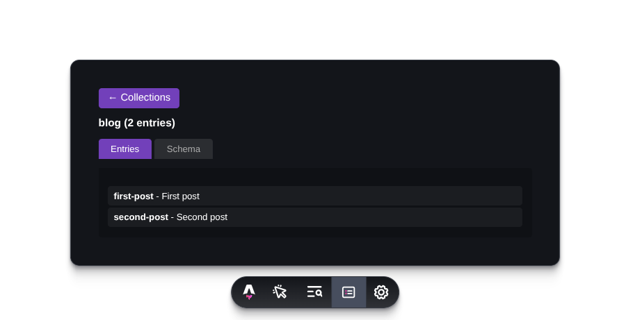
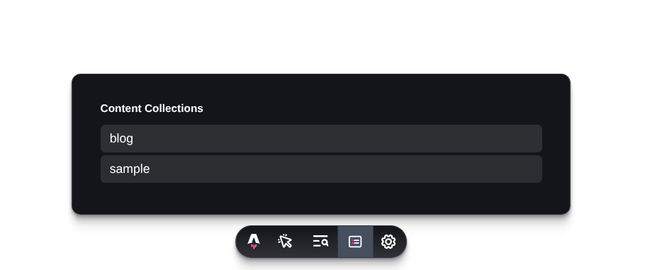

# **Astro Content Viewer — Dev Toolbar App**

Astro Content Viewer is a Dev Toolbar extension that allows you to browse your **Astro Content Collections**, inspect entries, visualize data as JSON, and preview inferred schemas directly inside your browser during development.



---

## 🚀 Features

* Automatically detects and lists all Astro content collections.
* Supports **all valid Astro export patterns**, including:

  * `export const collections = {...}`
  * `export { collections }`
  * `export default collections`
  * `export default { collections }`
* Scans multiple possible config file locations:

  * `src/content/config.ts/js/mjs`
  * `src/content.config.ts/js/mjs`
* Shows all entries of a selected collection.
* Displays entry data using a structured JSON viewer.
* Generates a simple **auto-inferred schema** from entry values.
* Clean Dev Toolbar UI: tabs, navigation, JSON preview, schema explorer.

---

## 📦 Installation

```bash
npm install -D astro-content-viewer
# or
pnpm add -D astro-content-viewer
# or
yarn add -D astro-content-viewer
```

---

## 🔧 Usage

Add the integration to your `astro.config.mjs` or `astro.config.ts`:

```ts
import { defineConfig } from "astro/config";
import contentViewer from "astro-content-viewer";

export default defineConfig({
  integrations: [
    contentViewer(), // Adds the Content Viewer to Astro’s Dev Toolbar
  ],
});
```

Once Astro Dev Server runs, open the Dev Toolbar and click **Content Viewer**.

---

## 🖼️ What You Can Do



Inside the Dev Toolbar:

* View all content collections.
* Open a collection and list its entries.
* Click an entry to see:

  * **JSON data** (pretty-printed)
  * **Raw representation**
* Explore automatically inferred schemas:

  * type detection
  * sample values
  * easy-to-read field overview

Perfect for debugging large content collections or third-party loaders.

---

## 🔍 Automatic Config File Detection

The integration searches for the content configuration in the following locations:

```
src/content/config.ts
src/content/config.js
src/content/config.mjs
src/content.config.ts
src/content.config.js
src/content.config.mjs
```

The system supports both named and default exports.

---

## 🤝 Contributing

Contributions are welcome!
Suggestions for improvements include:

* support for Astro data collections
* markdown preview tab
* enhanced schema inference
* search and filtering capabilities
* UI improvements

Open an issue or pull request on GitHub.

---

## 📄 License

MIT © 2024